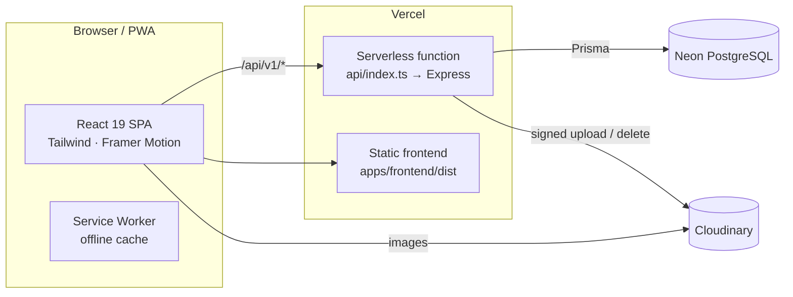
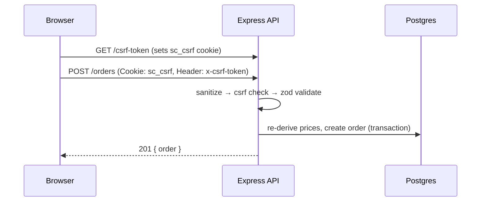

# Architecture

## System overview

The frontend and API deploy as a **single Vercel project** on one origin
(`sharvicollections.vercel.app`). Static assets are served from `apps/frontend/dist`; every
`/api/*` request is rewritten to the serverless function in `api/index.ts`, which is the same
Express app used in local development. Same-origin means the browser makes no cross-site
requests, so cookies and CSRF work cleanly.

## Layers

- **`packages/shared`** — the single source of truth for DTO types, Zod validation schemas,
  money formatting (SEK, stored as minor units), and slug generation. Imported by both apps.
- **`apps/backend`** — Express app split into `config`, `lib` (prisma, cloudinary, tokens,
  serialisers, audit), `middleware` (auth, csrf, rate-limit, sanitize, validate, error), and
  versioned `routes`. Handlers are thin; validation is schema-driven.
- **`apps/frontend`** — routed SPA. Data fetching via TanStack Query; cart & UI state via
  Zustand (cart persisted to `localStorage`); forms via React Hook Form + Zod. Admin is fully
  code-split from the storefront bundle.

## Request lifecycle (mutation)

## Money handling

All monetary values are stored and transferred as **integer minor units (öre)** — `349 kr`
is `34900`. This avoids floating-point rounding. Display formatting happens once via
`formatSEK()` (Intl, `sv-SE`/`en-SE`), always rendering `kr` — never `$`.

## Security

| Concern | Mitigation |
|--------|-----------|
| Password storage | **Argon2id** (`@node-rs/argon2` at runtime; node-`argon2` in scripts) |
| Sessions | Short-lived **JWT access** + **rotating refresh** tokens, both in **HttpOnly, Secure, SameSite=Strict** cookies; refresh tokens stored **hashed** (SHA-256) and revocable |
| CSRF | **Double-submit cookie** — non-HttpOnly `sc_csrf` echoed in `x-csrf-token`, required on all non-GET requests |
| Headers | **Helmet** (CSP in prod, cross-origin policies) |
| CORS | Explicit **allow-list** with credentials |
| Rate limiting | Global + strict auth limiter + order limiter (`express-rate-limit`) |
| Injection | **Prisma** parameterised queries (SQLi-safe) + recursive input **sanitisation** (strips `<>` and `$`/`.` keys) |
| Uploads | **Multer** memory storage, MIME + size limits, **Cloudinary signed** uploads |
| Authorisation | `requireAuth` + `requireRole('ADMIN')` on every privileged route |
| Auditing | `AuditLog` rows for logins, product/order mutations, uploads |
| Pricing integrity | Order totals are **re-derived server-side** from the DB; client prices are never trusted |
| Privacy (GDPR) | No tracking cookies, no analytics pre-consent, `ConsentLog` trail, hidden products never exposed |

## Performance

- Route-level **code splitting** (`React.lazy`) + manual vendor chunks (react, motion, query, i18n).
- **Cloudinary transformations** (`f_auto,q_auto`, width) requested per use-site; lazy-loaded images with skeletons.
- **PWA** runtime caching (Workbox) for app shell and Cloudinary images.
- TanStack Query caching with `keepPreviousData` for snappy filtering/pagination.
