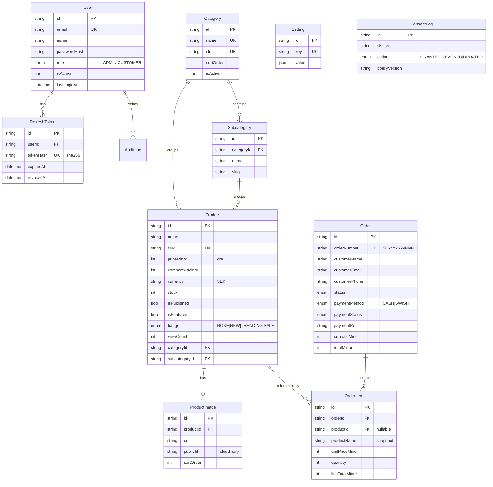

# Database

PostgreSQL (Neon) modelled with Prisma. Source of truth: [`prisma/schema.prisma`](../prisma/schema.prisma).

## ER diagram



## Design notes

- **Money** is stored as integer minor units (`priceMinor`, `totalMinor`, …) to avoid float errors.
- **Order items snapshot** `productName`, `productImage` and `unitPriceMinor` so historical orders
  remain correct even if the product is later edited or deleted (`productId` is nullable with
  `onDelete: SetNull`).
- **Hidden products** (`isPublished = false`) are filtered out of every storefront query.
- **Refresh tokens** are stored only as SHA-256 hashes and can be revoked (rotation on refresh).
- **Order numbers** are human-friendly and double as the **Swish payment reference** (`SC-2026-0001`).

## Migrations & seed

```bash
npm run prisma:migrate     # create/apply a dev migration
npm run prisma:deploy      # apply migrations in production/CI
npm run prisma:seed        # taxonomy + admin + settings
```

The seed inserts the exact category/subcategory taxonomy, the bootstrap admin (from
`SEED_ADMIN_*` env vars), and baseline settings.
